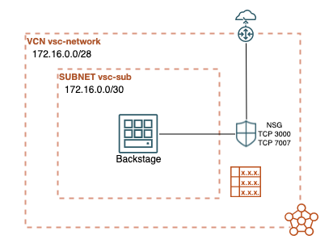

# Backstage on Oracle Cloud Infrastructure 

[](https://img.shields.io/badge/license-UPL-green) 


## Deploy Backstage on a compute instance running on Oracle Cloud Infrastructure 

Terraform script to deploy [Backstage](https://backstage.io/) on Oracle Cloud Infrastructure compute instance.

## Introduction
This project enables you to create and configure network and compute resources on OCI and launch a Backstage instance.


## Architecture Diagram



> Warning: the backstage instance is exposed on Internet with port 3000 and 7007 open.
### Prerequisites
You will need to collect the following information before you start:

1. your OCI provider authentication values
2. SSH public key
3. a compartment OCID in which the instances will be created (optional)
## Getting Started

1. Prepare one [Terraform Variable Definition file] named `terraform.tfvars` with the required authentication information.

   *TIP: You can rename `terraform.tfvars.example` and enter your configuration*

2. Provision the infrastructure and launch Backstage using the following commands:

    ```shell
    > terraform init
    > terraform plan
    > terraform apply
    ```  

    **Note**: the infrastructure will be available in few minutes, however the Backstage setup will take much longer to complete (up to 15 minutes). To monitor the process:
    1. connect via SSH to the instance
    2. launch the following command
        ```shell
        $ tail -fn 100 /var/log/cloud-init-output.log
        ```  
3. Get the public IP of the instance from the Terraform output and open http://<PUBLIC_IP>:3000 in your browser

## URLs
For more information about `Backstage`: 
* [Backstage Docs](https://backstage.io/docs/overview/what-is-backstage)

## Know Issues


## Contributing
This project is open source.  Please submit your contributions by forking this repository and submitting a pull request!  Oracle appreciates any contributions that are made by the open source community.

## License
Copyright (c) 2024 Oracle and/or its affiliates.

Licensed under the Universal Permissive License (UPL), Version 1.0.

See [LICENSE](LICENSE) for more details.

---


[](https://sonarcloud.io/dashboard?id=oracle-devrel_terraform-oci-backstage)

